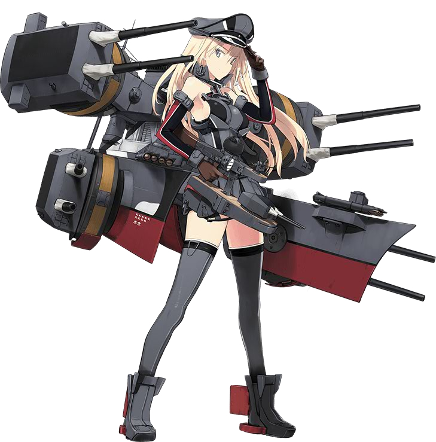

[←](readme.md)

# Немцы

- [Эсминцы](#Эсминцы)
- [Крейсеры](#Крейсеры)
- [Линкоры](#Линкоры)

## Эсминцы

## Крейсеры

**Плюсы**
- Калибр 203 мм с 7-го уровня
- Пробитие фугасов 1/4
- Повышенная альфа ББшек
- Хорошая дальность стрельбы
- Много торпед с удобными углами пуска
- Неплохая для крейсеров живучесть с 7-го уровня
- Дальнобойный немецкий гидрач

**Минусы**
- Малые альфа и шанс поджога фугасов
- Пушки на уровнях 7-8 расположены по схеме A-B-X-Y и их мало, как следствие, низкий ДПМ
- Относительно медлительны
- Дальность хода торпед 6 км

**Königsberg (5)** и **Nürnberg (6)** надёжные поставщики девстрайков для линкоров. Будучи лёгкими крейсерами, им проще стрелять из-за островов. Схема размещения башен A-X-Y помогает в кайте, но мешает в атаке.

**York (7)** в патче 0.9.3 получил бронирование оконечностей 25 мм. Вполне играется на фугасах, альфа которых нетипично высока для немецкого корабля.

**Admiral Hipper (8)** получает даунгрейд в фугасной альфе, поэтому по бортоходам рекомендуется использовать ББшки на дистанциях, позволяющих уверенно попадать в надстройки линкоров и цитадель/казематы крейсеров (справедливо и для следующих по ветке кораблей). Бронирование оконечностей возрастает до 27 мм, что позволяет отбивать ББшки калибром до 406 мм. Танкует линкоры в ближке ровным бортом и не ловит цитадели в нос, благодаря 40 мм нашлёпке.

**Roon (9)** прибавляет в ДПМе и обладает компоновкой типа пятёрки-шестёрки, располагающей к кайту. Роона-носоёба с ГК унижают даже эсминцы. Носовая нашлёпка теперь не достаёт до кончика носа, поэтому ровным носом переть на линкор может быть чревато.

**Hindenburg (10)** получает доволнительную башню в нос и бафф к скорости их вращения. Этот корабль довольно серьёзно апали, выдав дополнительную хилку и уменьшив перезарядку ГК. Хороший ДПМ, хорошая живучесть, но долгая перекладка и посредственная скорость. Хорошо воюет на всех дистанциях, рекомендуется к прокачке.

**Как играть**

Маневрируешь-стреляешь-живёшь. Благодаря хорошим углам пуска торпед, оконечностям 27 мм и гидрачу, способны ездить в ближку практически к любому противнику.

[←](readme.md)[↑](#Немцы)

## Линкоры

**Плюсы**
- Башни неплохо крутятся
- Наличие ПМК с неплохой дальностью, радующего глаз визуальными эффектами
- Хитрое бронирование цитадели, благодаря чему её сложно поразить артиллерией
- Казематы защищены от прямого фугасного урона крейсеров
- Неплохая скорость с 7-го уровня
- Дальнобойный немецкий гидрач с 8-го уровня

**Минусы**
- ГК попадает разве что случайно
- Мало пушек (кроме десятки)
- Бронированные казематы хорошо взводят ББшки
- Практически на всех кораблях сетап башен A-B-X-Y
- Крупная надстройка
- Плохая ПТЗ

**Gneisenau (7)** единственный веточный линкор с торпедами. Самый быстрый на своём уровне (и в ветке). Обладает редким для немцев сетапом башен A-B-X, обеспечивающих ужасающую в плохом смысле плотность залпа. Удачи попасть в стоячий бортом крейсер с дистанции 10+. Если удалось ворваться и раздать с ГК/ПМК/торпед, дамаг, возможно, будет. Во всех остальных случаях, увы.

**Bismarck (8)** получает дополнительную башню в корму, гидрач и объёмную надстройку, кушающую то, что не залетело в борт и казематы.

**Friedrich der Große (9)** обладает чудесной компоновкой, вынуждающей разворачиваться бортом для стрельбы всеми орудиями. Много хп, довольно быстрый КД ГК, неповоротливость. Имеет два участка палубы с бронированием 80 мм, которые не пробиваются никакими крейсерскими фугасами. Ещё части оконечностей, примыкающих к палубе, прикрыты бронелистами 50 мм, так что это корабль с лучшей защитой палубы из всей ветки.

**Großer Kurfürst (10)** прибавил по одному орудию на башню ГК и отвратителен в атаке (линкоры д0вления и ближнего боя, да), но прекрасен в кайте. Спасибо гениям, проектировавшим лодку, за такие углы наводки ГК. Иногда попадает и даже наносит урон. Жирен, любимая еда для всех, кто может до него дострельнуть. Гидрач не особо помогает этому мастодонту, скорее это средство придания уверенности водителю данной лохани. Звук стоковых стволов в одном из патчей стал дерьмом, поэтому рекомендуется играть на 420 калибре.

**Как играть**

Пара слов об отношении остальных участников боя к немецким ЛК: все красные игроки в курсе про то, что немцы никуда не попадают, жрут сотни урона в казематы и надстройку, а сближение с ними нежелательно.

Таким образом, попытка «давить и танковать» в начале боя как правило заканчивается печально для незадачливого водителя броневанны.

Основной урон, получаемый немцами: казематный (хилится на 50%) и ДОТ-урон (пожары, хилятся на 100%). Затопления? У немцев практически нет ПТЗ, ловить торпеды категорически нельзя. Гидрач тут поможет разве что Бисмарку, который ещё как-то рулится и не обладает размерами среднего любителя баварских сосисок с пивом.

Поэтому в начале боя желательно действовать от дистанции, но быть при этом неподалёку от союзников, чтобы в случае чего оказать им поддержку. Пресловутая танковка, да. Немец может выбежать вперёд, сделать некий импакт/помочь добрать важную цель/отвести фокус от союзных крейсеров/заставить отступить противника, и при этом уйти живым на отхил. Трудность заключается в выборе момента, когда делать конкретное действие.

Вылез слишком рано? Бесполезно сдох/всрал своё хп и расходники.
Вылез слишком далеко в попытке д0вления? Бесполезно сдох/всрал своё хп и расходники.
Проебал момент, когда надо было отсвечиваться/убегать? Бесполезно сдох/всрал своё хп и расходники.
Сосировал на респе максимально далеко от обжективов и пытался куда-то попасть со своих вилок? Лёхи закинули бой и тебя заклевали толпой, умер без настрела.

Когда врагов становится поменьше, можно уже поврываться, дать поработать ПМК, посходиться с красными линкорами на кулачках. Если немец не жрёт торпеды и не ловит сотни урона в борт, убить его довольно сложно, разве что будет накрутка на кучу пожаров.

Резюмируя, ветка не рекомендуется к прокачке. Хоть немцы и могут показаться нуб-френдли линкорами, благодаря условной живучести, **тащить бои и настреливать** на них непросто. А уж какой задомазохизм вождение девятки и десятки, которые из-за компоновки либо жрут урон, либо стреляют только из половины пушечек...

Да, пара слов о ПМК-билдах. Немецкий ПМК пробивает 32 мм начиная с 7-го уровня (с этого уровня упарывание в ПМК приобретает хоть какой-то смысл). ПМК может добрать подранка, позволив отстреляться из ГК по другой цели. Может в конце-концов сломать ТА пикирующему крейсеру/эсминцу. Позвоялет приехать к красному ЛК в ближку, встать ромбом, выставить фокус ПМК на него, а самому пулькать по другим целям. Бритам и французам особенно доставляет немецкий ПМК.

И если не упарывать немцев в ПМК, на кой чёрт вообще их качать и выкатывать?

[←](readme.md)[↑](#Немцы)
