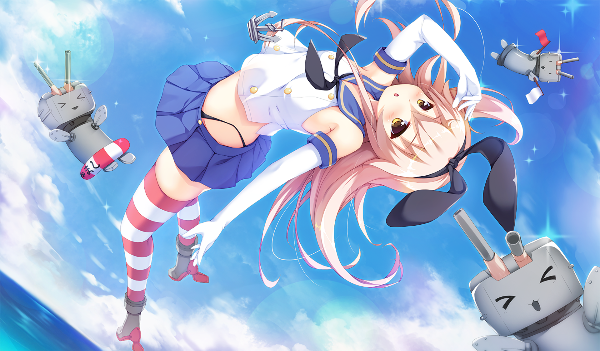

[←](readme.md)

# Японцы

- [Эсминцы](#Эсминцы)
- [Крейсеры](#Крейсеры)
- [Линкоры](#Линкоры)

## Эсминцы

#### Ветка Шимаказы (упор на торпеды)

**Плюсы**
- Хорошая скорость
- Лучшая маскировка на уровне, начиная с 8-го (Кагеро обладает лучшей маскировкой среди эсминцев вообще)
- Мощные и дальнобойные торпеды
- Большая альфа фугасов

**Минусы**
- Башни не крутятся
- Долгая перезарядка ГК
- Расположение башен ГК, хорошее на отходе, плохое в атаке (A-X-Y)

**Как играть**

Играются от инвиза, главное не сгореть на Мутсуки и понерфленной Фубуки, дальше пойдут годные лодки.
Играть от инвиза означает не только взятие точек, но и борьбу с эсминцами противника, поскольку они пересвечиваются.
Япошки довольно неплохо разваливают красные эсмы на кайте, благодаря компоновке и мощным фугасам, поэтому если у красного эсма нет особой поддержки, можно попытаться забайтить его на перестрелку. Либо просто светить для команды, лёхи достаточно охотно нынче пуляют по треугольникам.

#### Ветка Акизуки (упор на ГК с 8-го уровня)

**Плюсы**
- Скорострельные пушки
- Пробитие фугаса 32 мм с инерционкой
- Мощные торпеды

**Hatsuharu (6)** обладает лучшей на уровне маскировкой.

**Shiratsuyu (7)** может установить расходник на перезарядку торпед в слот дымов и высрать аж 16 штук практически одновременно.

**_У нижеперечисленных лодок 1 ТА на борт с расходником на быструю перезарядку торпед._**

**Akizuki (8)** обладает маневренностью крейсера (худшие скорость и радиус циркуляции), а так же весьма посредственной маскировкой.

**Kitakaze (9)** является лучшим эсминцем ветки. Лишён недостатков соседних кораблей, обладает хорошей маневренностью и маскировкой.

**Harugumo (10)** — взводятся линкорные ББшки и это весьма длинная лодка, что сказывается на циркуляции.

**Как играть**

До 8-го уровня играются как обычные торпедные эсминцы.

## Крейсеры

**Плюсы**
- Калибр 203 мм, не нуждающийся в инерционке (с 5-го уровня)
- Фугасы с высокими альфой и шансом поджога
- Много дальнобойных торпед
- Хорошая скорость
- Быстрая перекладка рулей
- Отличная маскировка

**Минусы**
- Башни не крутятся
- Долгая перезарядка ГК
- Посредственная дальность стрельбы
- Для стрельбы всеми башнями нужно раскорячивать борт
- Плохие углы пуска торпед
- Большая и уязвимая цитадель
- Длинный сосисочный силуэт, в который легко попадать
- Большой радиус циркуляции

**Furutaka (5)**, **Aoba (6)**, **Myoko (7)** надёжные поставщики девстрайков для красных линкоров. У Миоки большой пул хп и аж 10 пушек, что позволяет оторвать 20-25к ББшками какому-нибудь неосторожному однокласснику.

**Mogami** — можно играть стоковых стволах с инерционкой, что и следует делать, если ты не нищук и можешь себе позволить.

**Ibuki** разживается корректировщиком, возможностью установить модуль на дальность стрельбы и хилкой, что превращает корабль в ещё более бесючего фугасного спамера.

**Zao** обладатель одних из самых (если не самых) точных крейсерских орудий в игре. У ББшек накручены урон и пробитие, оба параметры выше, чем у ДеМойна. Имеется возможность уверенного инвизного пуска торпед.

**Как играть**

Ветка фугасного аутизма и отчаянного маневрирования. Необходимо проявление повышенного внимания к красным линкорам и их залпам. Не следует забывать про ББшки в борт подставившихся крейсеров на дистанциях <10 км (на больших дистанциях конский КД уже начинает подкладывать свинью). Наступающего противника можно обрадовать пачкой торпед, углы пуска как раз к этому располагают.

Благодаря маскировке, японцы могут оказать существенную поддержку союзному эсминцу, идя за ним в 3-4 км в случае засвета красного на точке в начале боя, но это для уверенных в своём скилле выживания.

## Линкоры

**Плюсы**

А нету общих для всей ветки плюсов. Особенности кораблей сильно скачут от уровня к уровню.

**Минусы**
- Башни не крутятся

**Kawachi**, **Myogi** являются кошмаром новичка. Этот мусор лучше проскакивать за швабодку.

**Kongo** — быстрый линейный крейсером с жирным пулом хп. Большой радиус циркуляции из-за вытянутого силуэта, в остальном довольно приятная и сбалансированная лодка.

**Fuso aka spray and pray** — дробовик с сигмой 1.5. Скорость уменьшилась, количество пушек увеличилось.

**Nagato** — пукалки 356 становятся серьёзными бабахалками 410 с сигмой 2.0. Неторопливая картонка дальнего боя.

**Amagi** завозят скорость и броню, а так же специфическую компоновку, располагающую к кайту. Неплохая лодка с мощной ПТЗ.

**Izumo** борется за звание самого уродливого корабля игры. Зато его трёхорудийные башни размещены по схеме A-B-C и эти пушечки имеют **самое высокое бронепробитие в игре до 12 км** (среди имеющихся кораблей, не считая тестовые). Сигма 2.0 и не так давно апнутое бронирование палубы делают Изюм весьма неплохой лодкой. С отвратительной перекладкой.

**Yamato** должен быть у каждого. Но играть на нём не стоит, если ты не мазохист. Орудия калибром 460 мм оверматчат обшивку 32 мм (т.е. оконечности других линкоров) и обладают сносной точностью особенно с уникальной модернизацией. Однако башни **совсем не крутятся**, маневренность у корабля посредственная, а цитадель выбивается в ромб на ближней дистанции. Линкор-носоёб на 1/4 и любимая еда любого фугасного противника.

**Как играть**

В основном, как корабли средне-дального боя. Японская схема разлёта снарядов такова, что они точнее остальных наций на дистанциях выше 10-12 км.

[←](readme.md)

