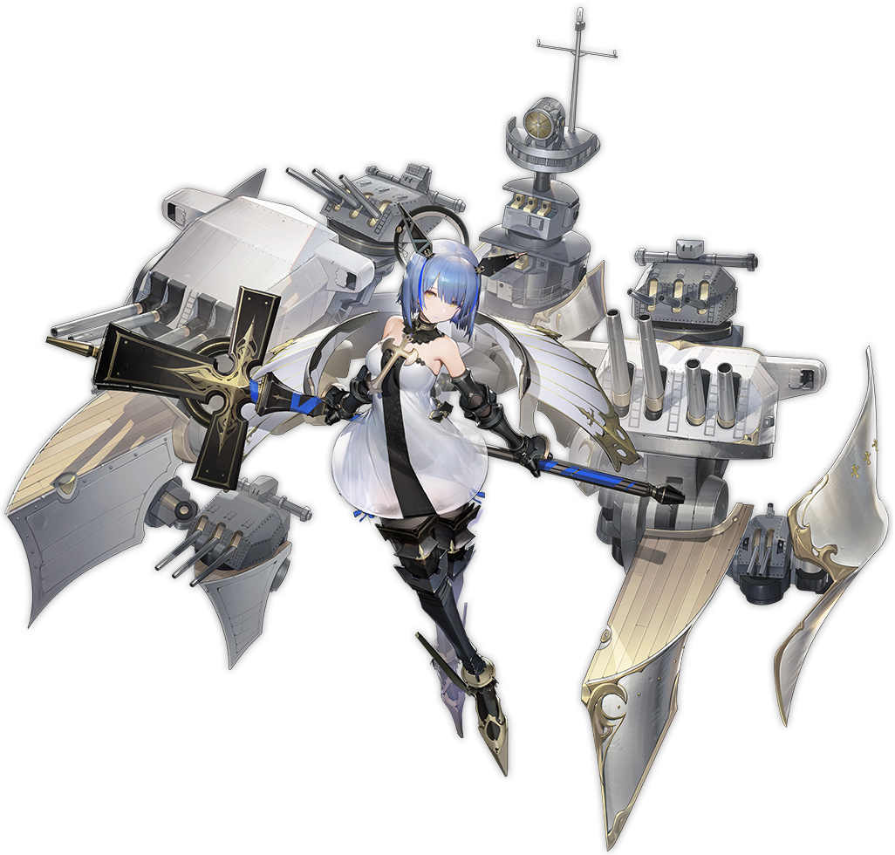

[←](../readme.md)

# Французы

- [Эсминцы](#Эсминцы)
- [Крейсеры](#Крейсеры)
- [Линкоры](#Линкоры)

## Эсминцы

## Крейсеры

**Плюсы**
- Хорошая дальность стрельбы
- Лучший расходник игры — биборан
- Усиленный форсаж на +20% скорости

**Минусы**
- Без форсажа скорость оставляет желать лучшего
- Плохая маскировка

**La Galissonnière (6)** неплохой лёгкий крейсер. Хорошо поворачивает, плохие углы наводки при отступлении, быстрая перезарядка торпед, но всего по 2 на борт.

**Algérie (7)** — плавучий макет тяжёлого крейсера. 8 пушек в сетапе A-B-X-Y, амероподобная баллистика, большой корпус, боль и страдания.

**Charles Martel (8)** — комфортабельный фугасный спамер. Имеет склонность к терять рули от любого фугаса, упавшего под жопу.

**Saint-Louis (9)** по сути пожирневшая восьмёрка.

**Henri IV (10)** разживается больно бьющим и хорошо пробивающим (оверматч лёгких бритухов и чмаленсков) калибром 240 мм. ББшки хороши на любых дистанциях по крейсерам-бортоходам. Корабль ускорился до 35 узлов без форсажа.

**Как играть**

Носиться на форсаже и закликивать врагов фугасами. Не стоит забывать и про бронебойные снаряды, особенно у топа ветки.

[←](../readme.md)[↑](#Французы)

## Линкоры

**Плюсы**
- Бортовая салютная батарея aka ПМК далеко пулькает
- Трудно поразить цитадель
- Неплохая скорость и форсаж с 8-го уровня

**Минусы**
- Плохо защищены против фугасного спама крейсеров
- Относительно малый калибр (кроме десятки)

**Bretagne (5)** ничем особенно не примечательный утюг. Из плюсов стоит отметить 10 пушечек и неплохую циркуляцию. Калибр 340 мм, как и у двух следующих кораблей.

**Normandie (6)** катается аж на 29.5 узлах скорости и имеет 12 орудий в трёх башнях, по 4 ствола в каждой.

**Lyon (7)** представляет собой ещё один spray and pray бронетазик о 16 пушках и сигмой 1.5. Скорость немного упала. Страшен в ближке.

**Richelieu (8)** толстеет калибром (380 мм), худеет количеством орудий (2 башни в носу по 4 ствола). Скорость достигает 32 узлов, сигма приходит в себя до уровня 1.8, а стоковая дальность равна аж 23 км.

**Alsace (9)** в прошлом был очень силён и бодр, что, естественно, недопустимо для веточного корабля. Дальность сдулась до 20.3 км (это с исследуемым модулем!), сигма до 1.6, перезарядка выросла до 32 сек. Спасибо, что хоть скорость не отпилили.

**République (10)** обладает упоротым сетапом башен A-X, по 4 ствола в каждой. Калибр 430 мм оверматчит коробки крейсеров и имеют в целом бешеное пробитие (самое высокое до 13 км), перезарядка самая быстрая на уровне, большая дальность 26 км и сигма 2.0 (не то, чтобы это особо ощущалось). Сильный дамагер.

**Как играть**

Геймплейно эти линкоры ближе к крейсерам из-за своей компоновки, бронирования и подвижности. Носоёбство на 1/4 чревато значительной потерей огневой мощи и сжиганием красными крейсерами, британской хилки тут нет. Поэтому манёвр, движение, позиционированирование для настрела в борта противнику, вот это вот всё. На форсаже легко улететь далеко и не туда, оставшись без укрытия и поддержки союзников, следи за своим положением.

Относительно малый калибр предполагает активную смену боеприпаса по ситуации. 340 мм французские пушечки имеют занерфленный до крейсерского шанс поджога (26%), так что отсутствию пожаров удивляться не стоит.

В ближке начинают ловить цитадели в борт от одноклассников. Не всегда, но на везение полагаться не стоит.

Ветка рекомендуется для подпивас-покатушек.

[←](../readme.md)[↑](#Французы)
