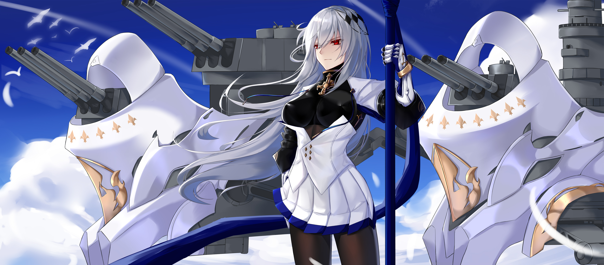

[←](../readme.md)

# Французы

- [Эсминцы](#Эсминцы)
- [Крейсеры](#Крейсеры)
- [Линкоры](#Линкоры)

## Эсминцы

## Крейсеры

**Плюсы**
- Хорошая дальность стрельбы
- Лучший расходник игры — биборан
- Усиленный форсаж на +20% скорости

**Минусы**
- Без форсажа скорость оставляет желать лучшего
- Плохая маскировка

**La Galissonnière (6)** непримечательный лёгкий крейсер. Хорошо поворачивает, плохие углы наводки при отступлении, быстрая перезарядка торпед, но их всего по 2 на борт.

**Algérie (7)** — плавучий макет тяжёлого крейсера. 8 пушек в сетапе A-B-X-Y, амероподобная баллистика, большой корпус, боль и страдания.

**Charles Martel (8)** — комфортабельный фугасный спамер. Имеет склонность к поломке рулей от любого фугаса, упавшего под жопу.

**Saint-Louis (9)** по сути пожирневшая восьмёрка.

**Henri IV (10)** разживается больно бьющим и хорошо пробивающим (оверматч лёгких бритухов и чмаленсков) калибром 240 мм. ББшки хороши на любых дистанциях по крейсерам-бортоходам. Корабль ускорился до 35 узлов без форсажа.

**Как играть**

Носиться на форсаже и закликивать врагов фугасами. Не стоит забывать и про бронебойные снаряды, особенно у топа ветки.

[←](../readme.md)[↑](#Французы)

## Линкоры

**Плюсы**

**Минусы**

[←](../readme.md)[↑](#Французы)
