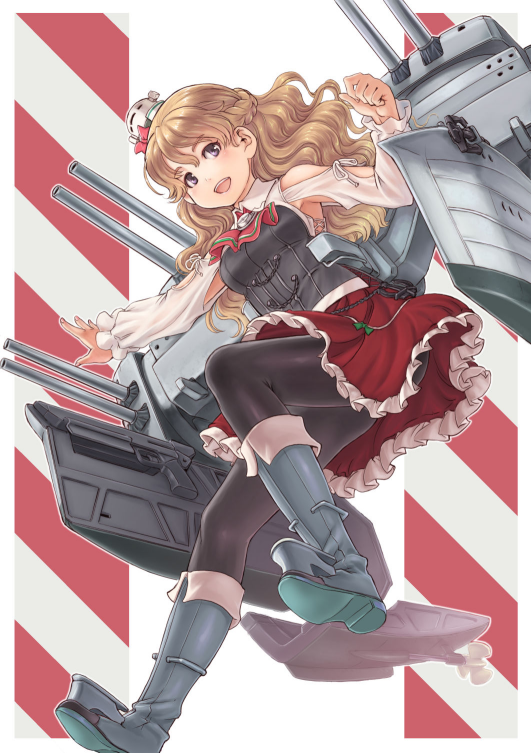

[←](../readme.md)

# Итальянцы

- [Крейсеры](#Крейсеры)

## Крейсеры

**Плюсы**
- Пока единственный обладатель ПББ снарядов
- Малозаметные дальнобойные торпеды
- Дымы полного хода
- Отличная скорость
- Удивительно малая циркуляция для таких корпусов

**Минусы**
- Посредственная дальность стрельбы
- Долгая перезарядка ГК
- Слоупочные торпеды
- Нет фугасов
- Нет гидрача
- Плохая маскировка

**Amalfi (8)** непримечательный, учитывая уровень боёв, тяжёлый крейсер. Плохим не назвать, но и хорошим тоже. Стоит отметить высокую скорость 37 узлов.

**Brindisi (9)** получает четвёртую башню на корму и нерф перезарядки. Весьма комфортен.

**Venezia (10)** разживается ещё одной башней в носу. Имеет апнутые на 5° рикошетные углы ПББшек, о чём естественно игрок должен догадаться сам. Торпедок стало на 1 меньше, всего по 3 на борт.

**Как играть**

Итальяшки хорошо делают следующее: дамажат в борта, убивают эсминцы и живут.

Соответственно, корабль желательно позиционировать, чтобы иметь возможность накидывать в борта. В начале боя можно попытаться подсаппортить союзный эсминец ближе к точке, но из-за конского засвета красный треугольник увидит тебя заранее и будет начеку.

Доджить снаряды очень легко благодаря накрученной маневренности, а на крайний случай есть WindWalk. Не следует забывать и о спаме слоупочных торпед, они не раз удивлят тем, что куда-то попали.

Наколачивать дамаг легко, но если союзные лёхи слились, затащить бой крайне проблематично. Нет маскировки и гидрача, соответственно, итальянец не может светить эсминцы и торпеды, даже красные крейсера на малом хп будут просто убегать, не давая нужные для победы фраги. Даже в случае подсвета, добрать выставившего жопу/нос подранка будет сложно. Посредственная дальность стрельбы не раз подложит свинью.

Тем не менее, ветка радует простотой игрового процесса и красивыми цифрами дамажки, к прокачке рекомендуется.

Уникальный командир Сосоньетти очень помогает в бою улучшенным навыком мастер-заряжающий и талантом на увеличение дальности после получения фрага.

[←](../readme.md)[↑](#Итальянцы)
