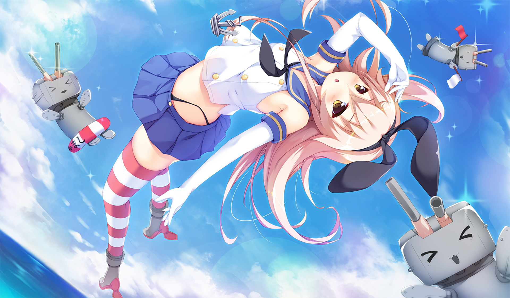
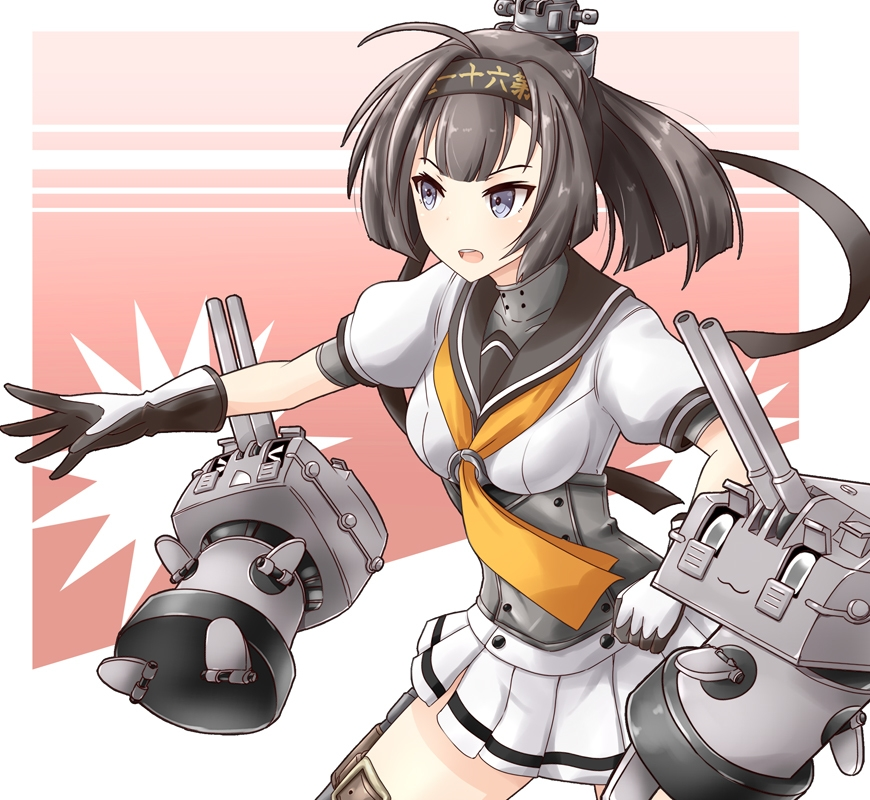
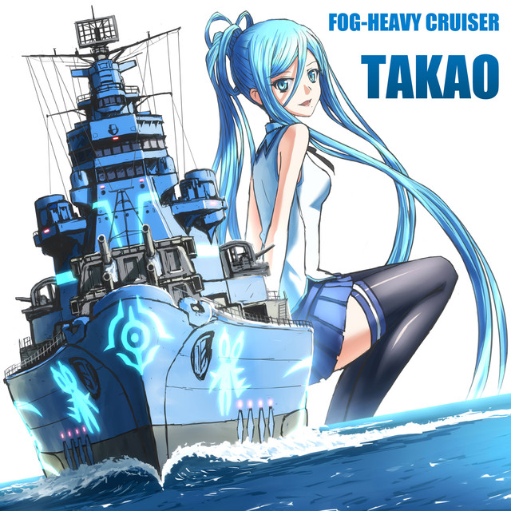

[←](../readme.md)

# Японцы

- [Эсминцы](#Эсминцы)
- [Крейсеры](#Крейсеры)
- [Линкоры](#Линкоры)

## Эсминцы

#### Ветка Шимаказы (торпедные)

**Плюсы**
- Хорошая скорость
- Лучшая маскировка на уровне, начиная с 8-го (у Кагеро лучшая маскировка среди эсминцев вообще)
- Мощные и торпеды с неплохой дальностью хода
- Высокая альфа фугасов

**Минусы**
- Башни не крутятся
- Долгая перезарядка ГК
- Расположение башен ГК, хорошее на отходе, плохое в атаке (A-X-Y)

**Mutsuki (5)** самый мерзкий корабль ветки, торпед толком нет, ГК представляет собой 2 пукалки, которыми только шотную цель с тысячей хп добрать и то, если повезёт.

**Fubuki (6)** имеет отвратительные углы пуска торпед, но торпедок уже 3х3. Когда-то у лодки было 3 башни ГК, одну отпилили с предсказуемыми последствиями.

**Akatsuki (7)** намного бодрее предшественника. Улучшились углы пуска торпед, добавилась башня ГК. Разве что маскировка так себе.

**Kagero (8)** обладает смехотворной дальностью стрельбы 9.4 км, что иногда играет ему на руку (проще отсветиться при уничтожении противника/постановке дымов). Лучшая маскировка 5.4 км.

**Yugumo (9)** получает более скорострельные и дальнобойные орудия ГК, засвет возрос на 100 м.

**Shimakaze (10)** по неизвестной причине имеет меньшую дальность стрельбы ГК и возросший на 100 м засвет. Торпед становится почти в 2 раза больше: 3 ТА х 5 торпед. Помимо этого, на выбор доступны три вида торпед. Для рандомчика обычно используются 12-километровые. Шиму любят фокусить, её торпеды серьёзная угроза.

**Как играть**

Играются от инвиза и торпед, что означает не только взятие точек и разведку, но и борьбу с эсминцами противника, поскольку они пересвечиваются.
Япошки довольно неплохо разваливают красные эсмы на кайте, благодаря компоновке и мощным фугасам, поэтому если у красного эсма нет особой поддержки, можно попытаться забайтить его на перестрелку. Либо просто светить для команды, лёхи нынче достаточно охотно пуляют по треугольникам.

Ветку можно прокачать, чтобы быть дауном, бесполезно спамящим торпедки издали. А пока торпедки на КД, времени хватит глотнуть пиваса и закусить. Шима популярнейший эсминец у лёх.

Если же изображать из себя борцуна с красными эсминцами и воителя переднего края, играются вполне бодро и интересно.

[←](../readme.md)[↑](#Японцы)

#### Ветка Акизуки (артиллерийские с 8-го уровня)

**Плюсы**
- Скорострельные пушки
- Пробитие фугаса 32 мм с инерционкой
- Мощные торпеды

**Hatsuharu (6)** обладает лучшей на уровне маскировкой.

**Shiratsuyu (7)** может установить расходник на перезарядку торпед в слот дымов и высрать аж 16 штук практически одновременно.

**_У нижеперечисленных лодок 1 ТА на борт с расходником на быструю перезарядку торпед отдельном слоте._**

**Akizuki (8)** обладает маневренностью крейсера (худшие скорость и радиус циркуляции), а так же посредственной маскировкой.

**Kitakaze (9)** является лучшим эсминцем ветки. Рулится лучше соседей по дереву развития, светится на меньшей дальности и не жрёт взведения линкорных ББшек. ТА раздулся в полтора раза и вмещает 6 торпед.

**Harugumo (10)** — взводятся линкорные ББшки и это весьма длинная лодка, что сказывается на циркуляции.

**Как играть**

До 8-го уровня играются как торпедные эсминцы.

[←](../readme.md)[↑](#Японцы)

## Крейсеры

**Плюсы**
- Калибр 203 мм, не нуждающийся в инерционке (с 5-го уровня)
- Фугасы с высокими альфой и шансом поджога
- Много дальнобойных торпед
- Хорошая скорость
- Быстрая перекладка рулей
- Отличная маскировка

**Минусы**
- Башни не крутятся
- Долгая перезарядка ГК
- Посредственная дальность стрельбы
- Для стрельбы всеми башнями нужно раскорячивать борт
- Плохие углы пуска торпед
- Большая и уязвимая цитадель
- Длинный сосисочный силуэт, в который легко попадать
- Большой радиус циркуляции

**Furutaka (5)**, **Aoba (6)**, **Myoko (7)** надёжные поставщики девстрайков для красных линкоров. У Миоки большой пул хп и аж 10 пушек, что позволяет оторвать 20-25к ББшками какому-нибудь неосторожному однокласснику.

**Mogami (8)** — можно играть стоковых стволах с инерционкой, что и следует делать, если ты не нищук и можешь себе позволить.

**Ibuki (9)** разживается корректировщиком, возможностью установить модуль на дальность стрельбы и хилкой, что превращает корабль в ещё более бесючего фугасного спамера.

**Zao (10)** обладатель одних из самых (если не самых) точных крейсерских орудий в игре. У ББшек накручены урон и пробитие, оба параметра выше, чем у ДеМойна. Имеется возможность уверенного инвизного пуска торпед.

**Как играть**

Ветка фугасного аутизма и отчаянного маневрирования. Необходимо проявление повышенного внимания к красным линкорам и их залпам. Не следует забывать про ББшки в борт подставившихся крейсеров на дистанциях <10 км (на больших дистанциях конский КД уже начинает подкладывать свинью). Наступающего противника можно обрадовать пачкой торпед, углы пуска располагают.

Благодаря маскировке (т.е. с 8-го уровня, когда появляется соответствующий модуль), японцы могут оказать серьёзную поддержку союзному эсминцу на точке, идя за ним в 3-4 км в начале боя. В таком случае, если союзный эсминец засветит красный, того можно будет или утопить, или изрядно потрепать. Для уверенных в своём скилле выживания.

Корабли в целом не вызывают какого-либо вау-эффекта, а потеть при игре нужно. К прокачке не рекомендуется.

[←](../readme.md)[↑](#Японцы)

## Линкоры

**Плюсы**

А нету общих для всей ветки плюсов. Особенности кораблей сильно скачут от уровня к уровню.

**Минусы**
- Башни не крутятся

**Kawachi (3)**, **Myogi (4)** являются кошмаром новичка. Этот мусор лучше проскакивать за швабодку.

**Kongo (5)** — быстрый линейный крейсером с жирным пулом хп. Большой радиус циркуляции из-за вытянутого силуэта, в остальном довольно приятная и сбалансированная лодка.

**Fuso (6) aka spray and pray** — дробовик с сигмой 1.5. Скорость уменьшилась, количество пушек увеличилось.

**Nagato (7)** — пукалки 356 становятся серьёзными бабахалками 410 с сигмой 2.0. Неторопливая картонка дальнего боя.

**Amagi (8)** завозят скорость и броню, а так же специфическую компоновку, располагающую к кайту. Неплохая лодка с отличной ПТЗ.

**Izumo (9)** борется за звание самого уродливого корабля. Зато его трёхорудийные башни размещены по схеме A-B-C и эти пушечки имеют **второе по силе бронепробитие на дистанции до 12 км** (первое у Республики). Сигма 2.0 и не так давно апнутое бронирование палубы делают Изюм весьма неплохой лодкой. С отвратительной перекладкой.

**Yamato (10)** должен быть у каждого. Орудия калибром 460 мм оверматчат обшивку 32 мм (т.е. оконечности других линкоров) и обладают сносной точностью, особенно с уникальной модернизацией. Однако башни **совсем не крутятся**, маневренность у корабля посредственная, а цитадель выбивается в ромб на ближней дистанции. Линкор-носоёб на 1/4 и любимая еда любого фугасного и/или торпедного аутиста.

**Как играть**

Как корабли средне-дального боя. Выкачать Ямато, покрутить его в порту и забыть об этой ветке.

[←](../readme.md)[↑](#Японцы)

