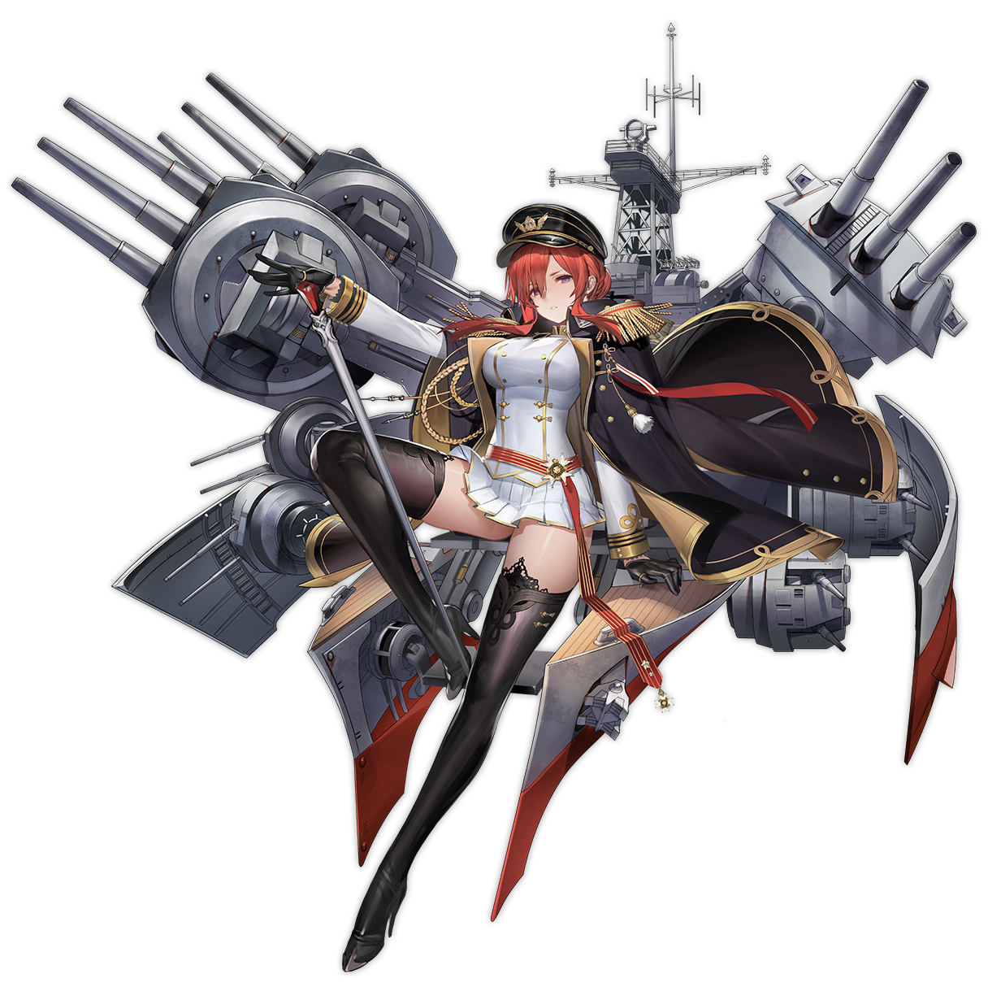

[←](../readme.md)

# Британцы

- [Эсминцы](#Эсминцы)
- [Крейсеры](#Крейсеры)
- [Линкоры](#Линкоры)

## Эсминцы

## Крейсеры

#### Ветка Голиафа (тяжёлые)

#### Ветка Минотавра (лёгкие)

**Плюсы**
- Льготные рикошетные углы ББшек
- Ультракороткий взрыватель
- Всратый баллистон со снарядами-парашютами, легче накидывать из-за островов
- Потрубный пуск торпед
- Есть хилка, с 8-го уровня чинит пол-корабля
- Есть дымы с 5-го уровня
- Возможность поставить РЛС с 8-го уровня вместо дымов
- Хорошая маскировка (кроме девятки)
- Встроенная модернизация на разгон
- Малая циркуляция

**Минусы**
- Всратый баллистон, к которому нужно привыкать
- Нет фугасов
- Нет дальности до 7-го уровня
- Нет брони
- Мало хп
- Посредственная скорость

**Emerald (5)** один из худших кораблей в игре, кошмар для своего водителя. Единственный вариант набить значимый урон — торпедные атаки на противников, благо, по какому-то странному недоразумению, торпед у этой лохани хоть отбавляй.

**Leander (6)** наконец-то начинает напоминать боеспособный корабль. Цитадель слегка выступает из воды, но имеет необычно малый размер. Ддальности серьёзно не хватает даже на своём уровне. Обшивка 13 мм, оконечности оверматчатся тяжёлыми крейсерами.

**Fiji (7)** получает увеличенный в 1.5 раза ДПМ за счёт дополнительного ствола в каждую башню. Дальность становится вполне комфортной. Очень сильный на своём уровне. Разве что торпедок маловато.

**Edinburgh (8)** разживается особой британской хилкой и возможностью воткнуть РЛС вместо дымов. ДПМ остался без изменений, поэтому корабль на своём уровне не так силён, как предшественник. Обшивка прибавила в толщине до 16 мм, оверматчится тяжёлыми бритухами и Анри. Один из немногих кораблей в ветке с нормальной жопой.

**Neptune (9)** получает ускоренные башни, полуторакратный буст скорострельности и кучу торпед. А так же неприлично торчащую над водой цитадель. Отличный дамагер, но недостаток маскировки будет ощущаться буквально в каждом бою.

**Minotaur (10)** обладает странным сетапом двухорудийных башен и бешенным ДПМом. Отличная маскировка.

**Как играть**

Бриты сильны в карании бортоходов, убийстве эсминцев и торпедном спаме. Торпеды довольно медленные и незаметные, поэтому неожиданно в кого-нибудь попадают, будучи пущены на отъебись.

С точки зрения позиционирования, соответственно, желательно оказаться в таком месте, чтобы была возможность настреливать в борта красным лёхам, не забывая про вариант развития событий, при котором придётся врубить экстренный съебатор. В дымах не следует просто стоять и пулькать залпами, легко отлететь от линкорного блайнда с корректировщика. Лучше ёрзать туда-сюда на малой скорости и стрелять побашенно.

Хорошие борцы с эсминцами, при наличии вижна. Из-за ультракороткого взрывателя, ББшки взводятся в корпусах эсминцев, делая тем оче больно. Однако, будучи ББшками, этот типа боеприпаса будет рикошетить при попаданиях в строго выставленные округлые нос/жопу треугольника. К этому следует быть готовым.

Сами бритухи цитаделятся всеми кораблями в игре, даже эсминцами, особенно французскими и советскими.

Вот, в общем-то, и всё. Рискованный геймплей и высокая огневая мощь делают лёгких бритов довольно фановым классом.

Доставят опытным игрокам.

[←](../readme.md)[↑](#Британцы)

## Линкоры

**Плюсы**
- Короткий взрыватель
- Пробой фугасов 1/4
- Высокие альфа и шанс поджога
- С 9-го уровня хилка чинит пол-корабля (+улучшенное восстановление казематного и цитадельного урона)
- Лучшая маскировка c 8-го уровня

**Минусы**
- Слабое бронирование
- Относительно мало хп
- Неважная точность

**Queen Elizabeth (6)** несколько выбивается из ветки, как обладатель хорошей точности, поэтому играбельна на ББшках. Хорошо крутится, но слоупочна и башни приварены. Еда для фугасных спамеров и обладателей калибров 380+.

**King George V (7)** имеет устрашающие фугасы и баффнутую перезарядку. Внимание на уменьшившийся до 356 мм калибр. Еда для фугасных спамеров и обладателей калибров 380+.

**Monarch (8)** получает нерф фугасов, 32 мм бронирование оконечностей, полноценный сетап башен A-B-X и паршивые углы наводки для задней башни. Можно играть от ББ, но не потому, что они хороши, а потому, что фугасы так себе. Благодаря маскировке, имеет несколько больше контроля над сближением и отступлением.

**Lion (9)** или возвращение накрученных фугасов. Появляется британская хилка.

**Conqueror (10)** получает ещё одну башню на корму. Отличные углы наводки башен при стрельбе вперёд.

**Как играть**

Бриты жрут прямой фугасный урон за обе щёки, имеют поднятую в одном из патчей цитадель, чтобы она слегка выступала над водой.

В целом, концепция ветки склоняет к фугасному аутированию на дальней дистанции. Несколько повышенный разлёт снарядов в залпе обеспечивает большую площадь накрытия фугасами. Девятка-десятка вполне могут поддержать команду на переднем крае фронта из-за зомби-хилки, главное трезво оценивать риски, поскольку под фугасным спамом крейсеров натурально расплавляются. Если нет особой фугасной угрозы, могут неплохо потанковать ромбом линкоры (кроме Ямат, разумеется).

Не стоит забывать и про ББшки, которые благодаря короткому взрывателю дают меньше сквозьняков по крейсерам.

Рекомендуется к прокачке для подпивас-закликивания в силуэт.
Помимо этого, ветка может быть интересна игроку, умеющему нажимать клавишу «2» и не дохнущему на средних дистанциях.

[←](../readme.md)[↑](#Британцы)
