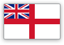

# WoWs thread — краткая справка по игре

- [Предупреждение](#Предупреждение)
- [Донат](#Донат)
- [Классы](#Классы)
- [Нации](#Нации)
- [Бронепробитие](#Бронепробитие)

# Предупреждение

Если ты игрок, в целом стремящийся играть эффективно и на результат, **остановись**. Эта игра не для тебя.

Игроки, отличные от подпивасов, отключивших мозг и заходящих пулькать по моделькам в прикольном корабельном антураже, по мере роста навыков и уровня понимания игры, будут испытывать прогрессирующее горение жопы, которое вытеснит со всременем практически все эмоции.

Серьёзно.

# Донат

Если хочешь сэкономить время и облегчить прокачку, есть смысл задонатить на корабельный премиум аккаунт.

**На что-либо иное донатить категорически не рекомендуется.**

С высокой вероятностью игрок, не являющийся подпивасом, становится хейтером. Манагерки, рулящие в данный момент проектом, прикладывают для этого серьёзнейшие усилия.

Даже если сейчас всё нравится и хочется напокупать лодочек за реал, **остановись**. Поверь, со временем это желание испарится полностью и будет жаль потраченных денег.

# Классы

## Эсминцы

**Особенности**

- Мало хп
- Малая дальность стрельбы
- Брони нет (кроме Хабаровска и чуть более бронированного борта Гиринга)
- Хорошая маскировка
- Высокая мобильность (+ наличие расходника «форсаж» практически у всех)
- Отсутствие цитадели
- От ББшек калибров выше 280 засчитывается дамаг только как от сквозняков (кроме Хабаровска и Харугумо)
- Короткая ремка с относительно быстрым откатом

**Задачи**

1. Разведка
2. Захват обжективов
3. Борьба с красными одноклассниками
4. Нанесение урона по остальным красным кораблям
5. Поддержка союзников полезными расходниками типа дыма/гидрача (в рандоме практически не встречается)

Выше перечислены особенности и задачи класса в целом, характеристики кораблей некоторых веток таковы, что приоритет задач, а так же стадия боя, на которой их можно выполнять, будут заметно отличаться от «обычных» эсминцев.

В первую очередь на эсминцах важно **не дохнуть**, что для большинства лёх почему-то недоступно на самом инвизном и шустром классе игры.

## Крейсеры

**Особенности**

- Среднее хп
- Хорошая мобильность
- Короткая ремка с относительно быстрым откатом

**Задачи**

1. Нанесение урона по красным кораблям
2. Поддержка союзников полезными расходниками

Формально крейсеры самый дамажный класс игры, но с реализацией цифр не всё так просто. Ценность крейсера возрастает по мере уменьшения количества красных кораблей и тиканья боевого таймера, поэтому важно уметь жить. Когда красных кораблей становится мало, крейсер даже с тысячей хп может занять удобную позицию за островом и сжечь нескольких врагов, которые бодаются с союзниками где-нибудь на точке.

Помимо этого сила класса растёт по мере увеличения уровней кораблей. Т.е. крейсер 9-го уровня сильнее на своём уровне, чем крейсер 6-го уровня на своём.

Крейсера с калибрами до 155 мм принято считать лёгкими. Крейсера с калибрами от 200 мм считаются тяжёлыми. Ну а советы с их 180 мм непонятно кем считаются и находятся в невыгодной позиции с точки зрения механики пробития фугасного снаряда.

## Линкоры

**Особенности**
- Много хп
- Хорошее бронирование (с оговорками)
- Наличие хила на всех уровнях
- Ремка от 10 до 20 сек с долгим откатом
- Долгая перезарядка, относительно низкая точность, но высокие альфа и бронепробитие/поджог снарядов
- Долгая перекладка рулей, скорость ниже, чем у других классов
- Наличие ПТЗ, заметно снижающей урон от торпед

**Задачи**

1. Нанесение урона
2. Отведение фокуса красной команды от союзных крейсеров и эсминцев
3. Позиционирование корабля в бою таким образом, чтобы быть ощутимой угрозой для красной команды (например, отгонять противника от обжективов)

Линкоры являются главной дойной коровой с точки зрения набивания урона. Наименьшее утилити среди всех классов.

# Нации

      

# Бронирование и бронепробитие

**WIP**

На картинке обозначены основные внешние зоны бронирования, прилетая в которые снаряд может снять ХП корабля.

1. Оконечность (носовая и кормовая)
2. Бронепояс
3. Каземат
4. Палуба
5. Надстройка

**Фугасы**

Пожар может возникнуть вне зависимости от того, пробил фугас броню или нет. Поэтому с точки зрения бронепробития следует рассмотреть толщины брони, которые пробиваются крейсерами, поскольку корабли этого класса являются основными фугасными спамерами игры.

Поскольку с переделкой инерционки пробитие крейсеров считается по-разному для уровней `[1, 8)` и `[8, 10]`, они вынесены в отдельные колонки. Помимо этого, пробитие фугасов немцев и британских тяжей составляет 1/4 калибра, поэтому около значения пробития будет указана нация, если потребуется. Рассмотрены уровня, начиная с 5-го.

| Калибр        | Пробитие `[5, 7]` | Пробитие с ИВ `[5, 7]` | Пробитие `[8, 10]` | Пробитие с ИВ `[8, 10]` |
| :-----------: |:-----------------:| :---------------------:|:------------------:|:-----------------------:|
| 150           |                   |                        |                    |                         |
| 152           |                   |                        |                    |                         |
| 155           |                   |                        |                    |                         |
| 180           |                   |                        |                    |                         |
| 200           |                   |                        |                    |                         |
| 203           |                   |                        |                    |                         |
| 220           |                   |                        |                    |                         |
| 234           |                   |                        |                    |                         |
| 240           |                   |                        |                    |                         |
| 305           |                   |                        |                    |                         |
| 310           |                   |                        |                    |                         |

**Бронебойные**

Благодаря наличию рикошетов в игре, урон, получаемый от бронебойных снарядов противников следует минимизировать позиционированием корабля таким образом, чтобы максимальное количество ББшек рикошетили. Как правило это позиционирование корабля носом/кормой к противнику, или под острым углом.

Поэтому важно рассмотреть так называемую механику оверматча (overmatch aka безусловное пробитие). Overmatch: если калибр снаряда превышает толщину брони в 14.3 раза, то снаряд беспрепятственно через неё пролетает, как будто этой брони не существует. Очевидно, что проверка на рикошет в таком случае не производится.

