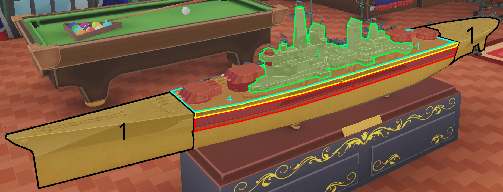

# WoWs thread — краткая справка по игре

- [Предупреждение](#Предупреждение)
- [Донат](#Донат)
- [Классы](#Классы)
- [Нации](#Нации)
- [Бронирование и бронепробитие](#БронированиеиБронепробитие)

# Предупреждение

Если ты игрок, в целом стремящийся играть эффективно и на результат, **остановись**. Эта игра не для тебя.

Игроки, отличные от подпивасов, отключивших мозг и заходящих пулькать по моделькам в прикольном корабельном антураже, по мере роста навыков и уровня понимания игры, будут испытывать прогрессирующее горение жопы, которое вытеснит со всременем практически все эмоции.

Серьёзно.

# Донат

Если хочешь сэкономить время и облегчить прокачку, есть смысл задонатить на корабельный премиум аккаунт.

**На что-либо иное донатить категорически не рекомендуется.**

С высокой вероятностью игрок, не являющийся подпивасом, становится хейтером. Манагерки, рулящие в данный момент проектом, прикладывают для этого серьёзнейшие усилия.

Даже если сейчас всё нравится и хочется напокупать лодочек за реал, **остановись**. Поверь, со временем это желание испарится полностью и будет жаль потраченных денег.

# Классы

## Эсминцы

**Особенности**

- Мало хп
- Малая дальность стрельбы
- Брони нет (кроме Хабаровска и чуть более бронированного борта Гиринга)
- Хорошая маскировка
- Высокая мобильность (+ наличие расходника «форсаж» практически у всех)
- Отсутствие цитадели
- От ББшек калибров выше 280 засчитывается дамаг только как от сквозняков (кроме Хабаровска и Харугумо)
- Короткая ремка с относительно быстрым откатом

**Задачи**

1. Разведка
2. Захват обжективов
3. Борьба с красными одноклассниками
4. Нанесение урона по остальным красным кораблям
5. Поддержка союзников полезными расходниками типа дыма/гидрача (в рандоме практически не встречается)

Выше перечислены особенности и задачи класса в целом, характеристики кораблей некоторых веток таковы, что приоритет задач, а так же стадия боя, на которой их можно выполнять, будут заметно отличаться от «обычных» эсминцев.

В первую очередь на эсминцах важно **не дохнуть**, что для большинства лёх почему-то недоступно на самом инвизном и шустром классе игры.

## Крейсеры

**Особенности**

- Среднее хп
- Хорошая мобильность
- Короткая ремка с относительно быстрым откатом

**Задачи**

1. Нанесение урона по красным кораблям
2. Поддержка союзников полезными расходниками

Формально крейсеры самый дамажный класс игры, но с реализацией цифр не всё так просто. Ценность крейсера возрастает по мере уменьшения количества красных кораблей и тиканья боевого таймера, поэтому важно уметь жить. Когда красных кораблей становится мало, крейсер даже с тысячей хп может занять удобную позицию за островом и сжечь нескольких врагов, которые бодаются с союзниками где-нибудь на точке.

Помимо этого сила класса растёт по мере увеличения уровней кораблей. Т.е. крейсер 9-го уровня сильнее на своём уровне, чем крейсер 6-го уровня на своём.

Крейсера с калибрами до 155 мм принято считать лёгкими. Крейсера с калибрами от 200 мм считаются тяжёлыми. Исключение составляет Могами, являющийся тяжёлым крейсером с возможностью установки 155 орудий. Советские "средние крейсеры" с калибром 180 мм находятся в невыгодной позиции с точки зрения механики пробития фугасного снаряда.

## Линкоры

**Особенности**
- Много хп
- Хорошее бронирование (с оговорками)
- Наличие хила на всех уровнях
- Ремка от 10 до 20 сек с долгим откатом
- Долгая перезарядка, относительно низкая точность, но высокие альфа и бронепробитие/поджог снарядов
- Долгая перекладка рулей, скорость ниже, чем у других классов
- Наличие ПТЗ, заметно снижающей урон от торпед

**Задачи**

1. Нанесение урона
2. Отведение фокуса красной команды от союзных крейсеров и эсминцев
3. Позиционирование корабля в бою таким образом, чтобы быть ощутимой угрозой для красной команды (например, отгонять противника от обжективов)

Линкоры являются главной дойной коровой с точки зрения набивания урона. Наименьшее утилити среди всех классов.

# Нации

      

# Бронирование&nbsp;и&nbsp;бронепробитие

**WIP**

На картинке обозначены основные внешние зоны бронирования, прилетая в которые снаряд может снять ХП корабля.

1. Оконечность (носовая и кормовая)
2. Бронепояс
3. Каземат
4. Палуба
5. Надстройка

**Фугасы**

Основными фугасными спамерами игры являются крейсера.

Пожар может возникнуть вне зависимости от того, пробил фугас броню или нет. Крейсера друг друга пробивают и без инерционки. Этот перк берут, чтобы появилась возможность наносить прямой урон по линкорам: в оконечности, каземат и палубу.

С переделкой инерционки пробитие крейсеров считается по-разному для уровней `[1, 8)` и `[8, 10]`, они вынесены в отдельные колонки. Помимо этого, пробитие фугасов немцев и британских тяжей (с калибром 234 мм) составляет 1/4 калибра, поэтому около значения пробития будет указана нация, если потребуется.

**Таблица пробития для крейсерских калибров, с 5-го тира.**

| Калибр        | Пробитие `[5, 7]` | Пробитие с ИВ `[5, 7]` | Пробитие `[8, 10]` | Пробитие с ИВ `[8, 10]` |
|:-------------:|:-----------------:|:----------------------:|:------------------:|:-----------------------:|
| 150-152       | 25, 38 (нем.)     | 31, 47 (нем.)          | 30                 | 37                      |
| 155           | -                 | -                      | 31                 | 38                      |
| 180           | 30                | 37                     | 30                 | 37                      |
| 203           | 34                | 42                     | 34, 51 (нем.)      | 42, 63 (нем)            |
| 220           | -                 | -                      | 37                 | 46                      |
| 234           | -                 | -                      | 59 (брит.)         | 73 (брит.)              |
| 240           | -                 | -                      | 40                 | 50                      |
| 283           | 71 (нем.)         | 88 (нем.)              | -                  | -                       |
| 305-310       | -                 | -                      | 51-52              | 63-65                   |

**Таблица линкорного бронирования, с 5-го тира. Числа даны по принципу корабль-оконечность-палуба-каземат.**
*два числа через слэш означают, что одна часть зоны бронирована так, другая эдак*

| Тир   | Япония             | США                  | Германия               |
|:-----:|:------------------:|:--------------------:|:----------------------:|
| 5     | Конго-19-19/38-152 | Нью-Йорк-19-19-25    | Кёниг-19-30-170/200    |
| 6     | Фусо-26-35-152     | Нью-Мексико-26-26-26 | Баерн-26-30/40-170/250 |
| 7     | Нагато-26-26/70-26 | Колорадо-26-26-26    | Гнейз-26-50-45         |
| 8     | Амаги-32-32-32     | Норка-32-38-32       | Бисмарк-32-50-160      |
| 9     | Изюм-32-57-32      | Айова-32-38-38       | ФДГ-32/50-80/50-145    |
| 10    | Ямато-32-50/57-32  | Монтана-32-38-38     | Курф-32/50-50-150      |

| Тир   | СССР                        | Британия              | Франция                   |
|:-----:|:---------------------------:|:---------------------:|:-------------------------:|
| 5     | Пётр-19/75-19/25/38-125     | Дюк-19-25/44-152/203  | Бретань-19-19/30-19/160   |
| 6     | Измаил-26-26-100            | Лизка-26-26/38-26/152 | Нормандия-26-26/30-26/180 |
| 7     | Синоп-26-26/35-75/100       | КГВ-26-26-26          | Лион-26-26/30-26/180      |
| 8     | Владивосток-32-40/50-40/200 | Монарх-32-32-32       | Ришелье-32-32-32          |
| 9     | Союз-32-60-60/375           | Лайон-32-32-32        | Эльзас-32-32-32           |
| 10    | Кремль-32-60-150            | Конь-32-32-32         | Республика-32-32-32       |

Японцы, британцы, французы и американцы (до Норки) плохо защищены от фугасов тяжёлых крейсеров и лёгких с инерционкой.
Немцы защищены лучше, поэтому стрелять следует в верхние области оконечности и надстройку. То же самое касается советов.

**Бронебойные**

Благодаря наличию рикошетов в игре, урон, получаемый от бронебойных снарядов противников следует минимизировать позиционированием корабля таким образом, чтобы максимальное количество ББшек рикошетили. Как правило это позиционирование корабля носом/кормой к противнику, или под острым углом.

Поэтому важно рассмотреть так называемую механику оверматча (overmatch aka безусловное пробитие). Overmatch: если калибр снаряда превышает толщину брони в 14.3 раза, то снаряд беспрепятственно через неё пролетает, как будто этой брони не существует. Очевидно, что проверка на рикошет в таком случае не производится.

