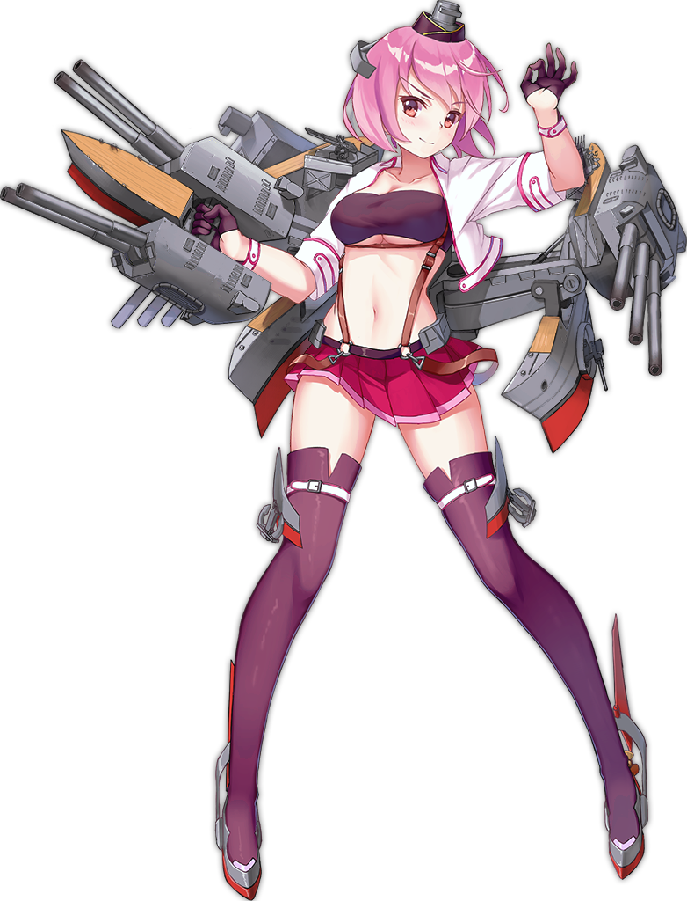

[←](readme.md)

# Американцы

- [Эсминцы](#Эсминцы)
- [Крейсеры](#Крейсеры)
- [Линкоры](#Линкоры)

## Эсминцы

## Крейсеры

#### Ветка ДеМойна (тяжёлые)

**Плюсы**
- Калибр 203 мм, не нуждающийся в инерционке (с 6-го уровня)
- Отличные бронебойные снаряды с улучшенными рикошетными углами
- Оконечность 27 мм начиная с 8-го уровня
- Компоновка, позволяющая поносоёбить и не сильно потерять в огневой мощи (кроме Буйвола и Пепсиколы)
- Всратый баллистон со снарядами-парашютами, позволяющий накидывать из-за островов
- Долгий радар на 10 км с 8-го уровня

**Минусы**
- Низкая дальность стрельбы
- Уязвимая цитадель
- Всратый баллистон, к которому нужно привыкать
- Нет торпед

**Pensacola (6)** и **New Orlean (7)** в патче 0.9.3 получили оконечность 25 мм, что позволяет им танковать ББшки калибром до 380 мм.

**Baltimore (8)** является лучшим крейсером 8-го уровня, по совокупности характеристик.

**Buffalo (9)** не смотря на те же орудия, что и у восьмёрки, имеет худшую перезарядку, поэтому ДПМ Буйвола-носоёба хуже Балтимора в той же ситуации. 12 орудий обеспечивают наибольшей альфа-страйк в ветке, но чтобы стрелять всеми, придётся подставить борт.

**Des Moines (10)** к прокачке обязателен. Это как Балтимор, только с хилкой, лучшим бронированием и увеличившимся в 2 раза ДПМом.

**Как играть**

Насиловать в борта крейсера ББшками, жечь линкоры, гонять РЛСкой эсминцы. Когда ситуация позволяет, делать это из-за острова. Поэтому желательно иметь представление о картах и островах на них.

#### Ветка Вустера (лёгкие)

## Линкоры

[←](readme.md)

