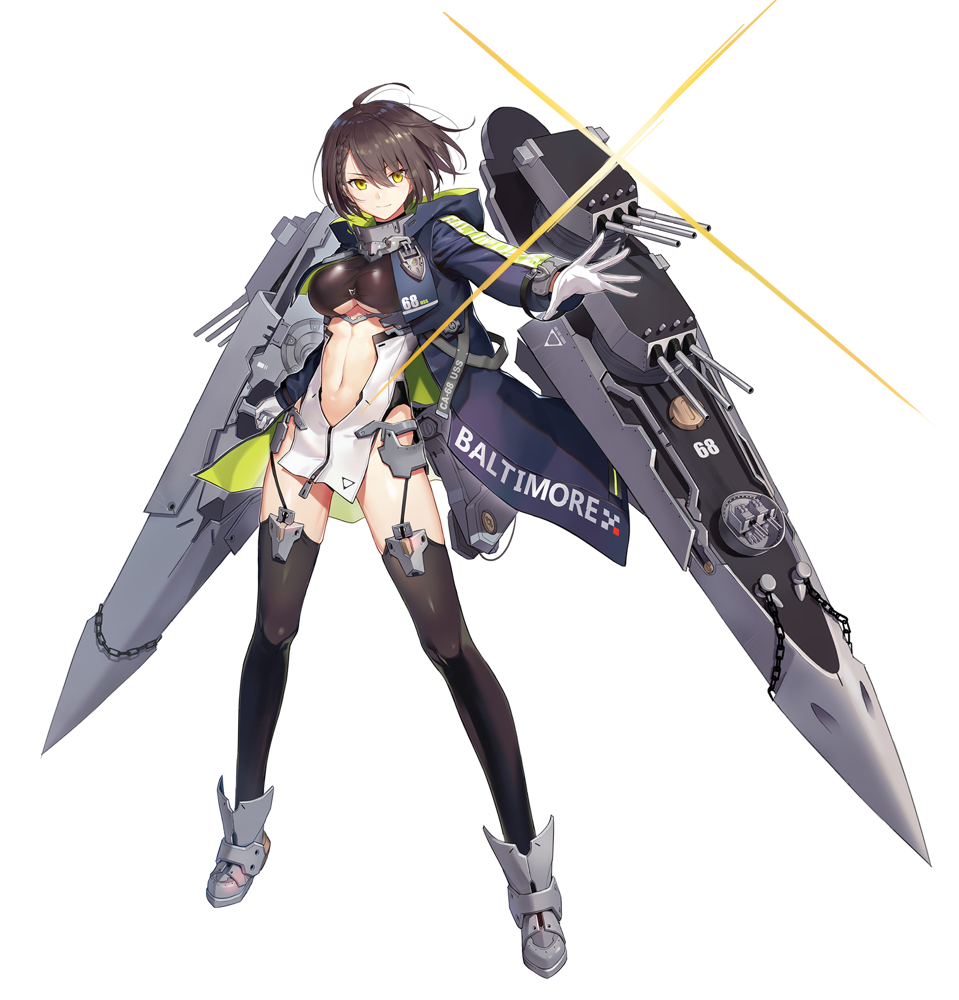
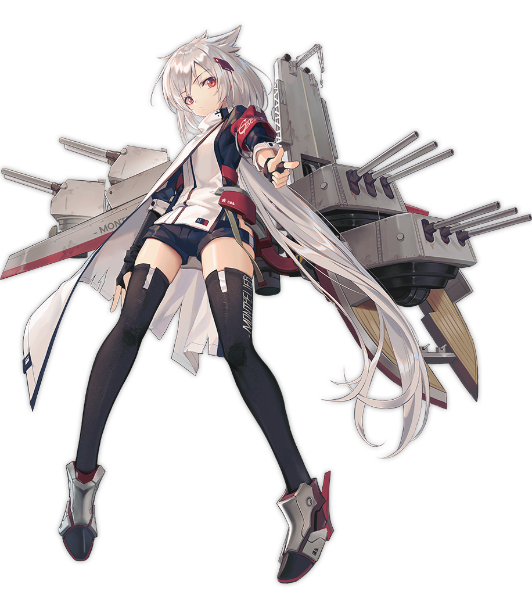
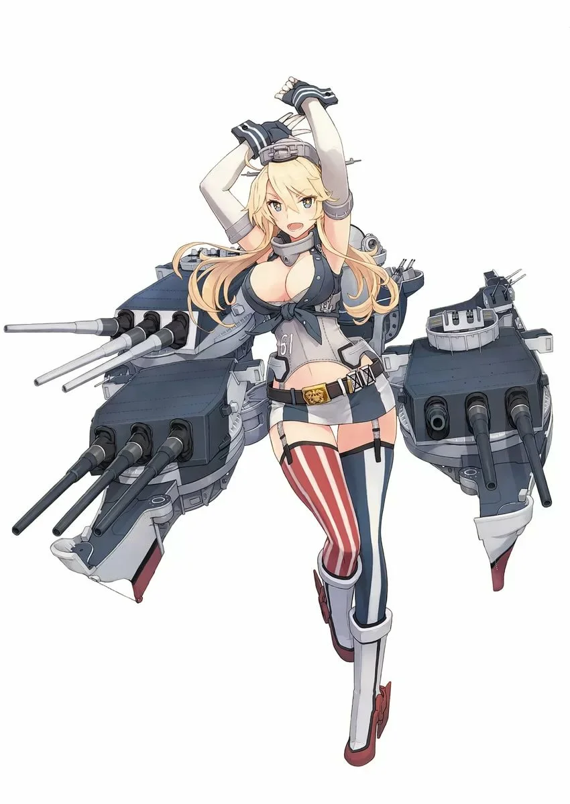

[←](readme.md)

# Американцы

- [Эсминцы](#Эсминцы)
- [Крейсеры](#Крейсеры)
- [Линкоры](#Линкоры)

## Эсминцы

## Крейсеры

#### Ветка ДеМойна (тяжёлые)

**Плюсы**
- Калибр 203 мм, не нуждающийся в инерционке (с 6-го уровня)
- Бронебойные снаряды с улучшенными углами пробития (могут пробивать под более острыми углами)
- Оконечность 27 мм начиная с 8-го уровня
- Компоновка, позволяющая поносоёбить и не сильно потерять в огневой мощи (кроме Буйвола и Пепсиколы)
- Всратый баллистон со снарядами-парашютами, легче накидывать из-за островов
- Долгий радар на 10 км с 8-го уровня

**Минусы**
- Низкая дальность стрельбы
- Уязвимая цитадель
- Всратый баллистон, к которому нужно привыкать
- Нет торпед (с 6-го уровня)

**Pensacola (6)** и **New Orlean (7)** в патче 0.9.3 получили оконечность 25 мм, что позволяет им танковать ББшки калибром до 380 мм при носоёбстве. Следует иметь в виду, Пенсакола является плавучим девстрайком, о чём известно всем линкорам на карте.

**Baltimore (8)** — лучший крейсер 8-го уровня, по совокупности параметров. Появилась РЛС, ускорилась перезарядка, ББшки стали лететь чуть медленее, но дамажить и пробивать сильнее. Бронирование оконечностей возрастает до 27 мм, что позволяет отбивать ББшки калибром до 406 мм. По неизвестной причине дальность стрельбы уменьшилась на 340 м.

**Buffalo (9)** не смотря на те же орудия, что и у восьмёрки, имеет худшую на 2 секунды перезарядку, поэтому ДПМ Буйвола-носоёба хуже Балтимора в той же ситуации. 12 орудий обеспечивают наибольший альфа-страйк в ветке. Ах да, с дальности стрельбы срезано ещё 280 м.

**Des Moines (10)** — отличный ДПМ, апнутое до 30 мм при переделке инерционки бронирование каземата, полезные расходники, уникальная модернизация, позволяющая тормозить и разгоняться как эсминец.

**Как играть**

Насиловать в борта крейсера ББшками, жечь линкоры, гонять РЛСкой эсминцы. Когда ситуация позволяет, делать это из-за острова. Поэтому желательно иметь представление о картах и островах на них.

Рекомендуется к прокачке.

[←](readme.md)[↑](#Американцы)

#### Ветка Вустера (лёгкие)

**Плюсы**
- Много орудий с неплохим ДПМом
- Всратый баллистон со снарядами-парашютами, легче накидывать из-за островов
- Расходники на все случаи жизни (радар с дальностью 9 км с 8-го уровня)
- Неохотно ловят цитадели с линкоров

**Минусы**
- Калибр 152 мм
- Низкая дальность стрельбы
- Всратый баллистон, к которому нужно привыкать
- Нет торпед (с 6-го уровня)

**Cleveland (8)** — РЛС, неплохие углы наводки орудий, хорошая маневренность. Отличный крейсер поддержки и фугасного спама, способный пободаться со своим тяжёлым соседом за звание лучшего КР8.

**Seattle (9)** имеет паршивую компоновку, вынуждающую раскорячивать борт для стрельбы всеми орудиями. Помимо этого, лодка плохо разгоняется и тормозит. Но увеличившийся (в том числе благодаря модулю на перезарядку) ДМП и появление хилки в какой-то степени компенсируют эти недостатоки.

**Worchester (10)** обладает атлантоподобным сетапом башен, но не то, чтобы это что-то серьёзно меняло. Дальность стрельбы становится сильно больше.

**Как играть**

Заливать всё фугасами из-за островов и поддерживать команду расходниками. Вполне играются на открытой воде, но на дистанции может быть сложно размениваться по хп с одноклассниками в свою пользу. В ближке способны унизить линкор, выставив ровный борт и ловя одни сквозьняки, насилуя противника ббшками в оконечности и казематы (когда хватает пробоя).

С тех пор, как в игре перестало существовать ПВО, кроме кучи полезных расходников и фугасного закликивания, ничего особенного ветка не предлагает, поэтому лучше выкачивать ДеМойна.

[←](readme.md)[↑](#Американцы)

## Линкоры

**Плюсы**
- Сетап башен A-B-Y с 8-го уровня
- Американская модернизация на точность с 9-го уровня
- Слегка улучшенная хилка
- Ремка работает 20 сек

**Минусы**
- До 8-го уровня сплошные слоупочные утюги
- Всратый баллистон, к которому нужно привыкать

**New Mexico (6) aka spray and pray** — собрат Фусо с такой же замечательной сигмой 1.5. Бодрости добавляет перезарядка, дольше японской аж на 6 секунд. Еда фугасных и торпедных спамеров, а так же обладателей орудий 380+.

**Colorado (7)** — пушек стало меньше, но возрос калибр, ускорилась перезарядка и увеличилась сигма до 2.0. Утюг, который может и уебать. Лучшая циркуляция на уровне.

**North Carolina (8)** — наконец-то завезли скорость. Обладает самыми долголетящими снарядами, что следует иметь в виду при взятии упреждения. Формально уязвимый борт (цитаделится тяжёлыми крейсерами в ближке). Неплохо крутится относительно одноклассников. Улучшенная сигма 2.0. Отличный линкор на своём уровне.

**Iowa (9)** не ощущается как некий шаг вперёд по сравнению с Норкой. Скорее шаг в сторону. Быстрый (34.6 с флагом) и неповоротливый трамвай с длинным и уязвимым бортом. Можно ставить американскую модернизацию на точность.

**Montana (10)** была бы лучшим ЛК10, отсутствуй в игре куча ЛК-457. Хорошо живёт ромбом, больно карает в борта на средней и ближней дистанции. Без использования корректировщика испытывает серьёзные трудности с дамагом носоёбов. Установка рулей и уникальной модернизации позволяет косплеить большой крейсер.

**Как играть**

До 8-го уровня это лодки одного фланга, из-за своей скорости сильно зависящие от действий союзников и противников. Начиная с Норки корабли становятся универсальными. Могут сменить фланг, могут подпушить/подефать, врубив режим носоёба. Могут отыгрывать от центральной части карты, благо дальность стрельбы неплохая. Баллистика облегчает закидывание снарядов через острова с корректировщика. Хорошо дамажат на средней дистанции, когда баллистика ещё не сильно факапит залпы. В ближке тоже неплохи, главное убить противника прежде, чем он зайдёт в борт.

Сейчас нет особого смысла качать эту ветку дальше 8-го уровня. А учитывая, какое дерьмо идёт до этого, напрашивается неутешительный вывод 
— ветка американских ЛК ньюфагу не нужна и не рекомендуется.

[←](readme.md)[↑](#Американцы)

