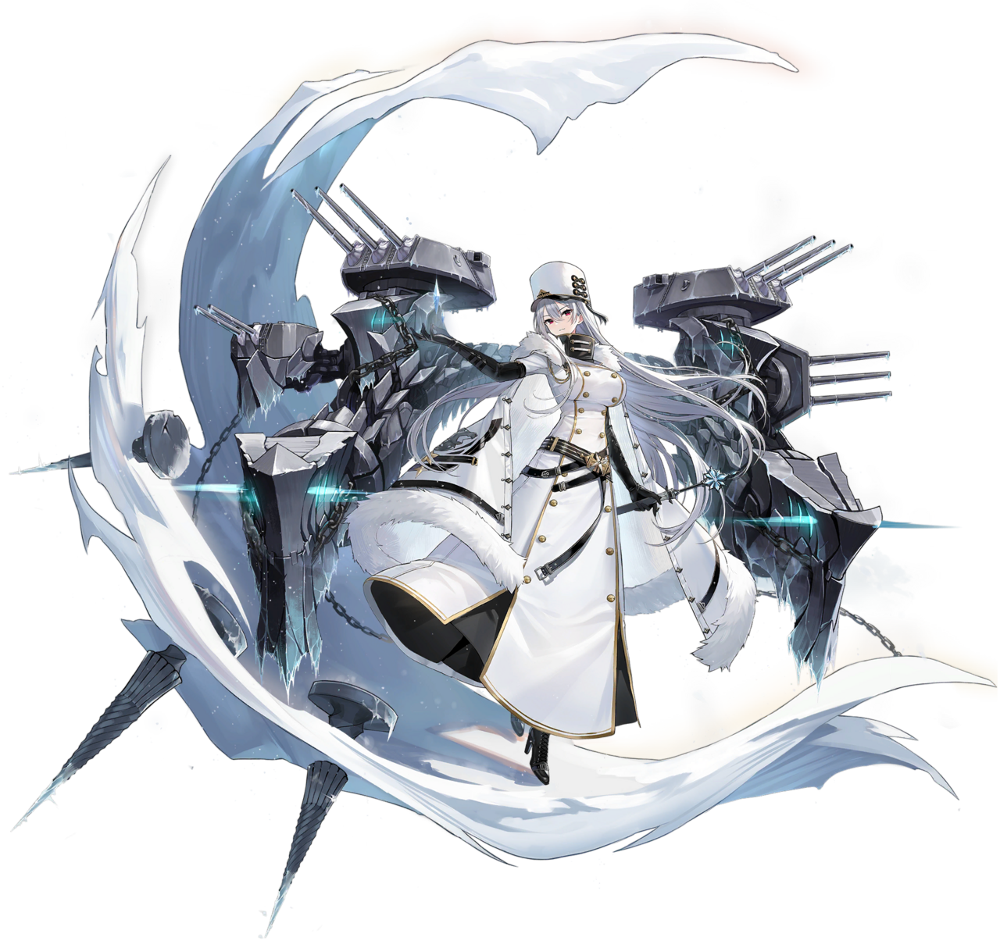

[←](readme.md)

# Советы

- [Эсминцы](#Эсминцы)
- [Крейсеры](#Крейсеры)
- [Линкоры](#Линкоры)

## Эсминцы

## Крейсеры

Скоро переебахтунг веток, поэтому расписывать сейчас нет смысла.

## Линкоры

**Плюсы**
- Иногда работающая фишка с улучшенным разбросом при сокращении дистанции
- Отличная живучесть в режиме носоёба
- Хорошо защищены от прямого фугасного урона крейсеров (палуба и казематы бронированы, надстройка маленькая)
- Быстрый откат ремки
- Несколько лучшая перекладка рулей, чем у одноклассников
- Неплохая скорость
- Сетап башен A-B-X уже на 7 уровне

**Минусы**
- Перезарядка 33 сек
- Посредственная дальность стрельбы и поставить корректировщик нельзя
- Большая и уязвимая цитадель
- Количество ремок ограничено
- Хилок на одну меньше
- Чудовищная циркуляция

**Пётр Великий (5)** откровенно имбует на своём уровне. Потому, что остальные веточные корабли слишком слабые. Крейсера без ДПМа, линкоры без брони и точности. Пётр танкует ромбом, а потом приезжает в ближку и шотает в борта. Углы наводки орудий лучшие в игре для компоновки A-B-X-Y.

**Измаил (6)** несколько выбивается из ветки, поскольку имеет кучу орудий и ничего не танкует. Отличный дамагер, но ловит кучу урона при стрельбе из всех башен в специальные бортовые снарядоуловители. Поэтому борт после выстрела следует сразу же прятать. Хорошо выносит крейсера благодаря небольшому калибру и куче снарядов в залпе. Обладатель приваренных башен и хорош в кайте, т.к. 3 из них крутятся через жопу.

**Синоп (7)** весьма силён на своём уровне  по тем же причинам, что и Пётр (хоть и не так, как последний на своём), носоёбская компоновка позволяет жить, оверматчащий одноклассников калибр к тому же хорошо цитаделит крейсера благодаря американоподобной баллистике. После нерфа сигмы до 1.5, возможно, уже не так гнёт. Башни по-прежнему приварены. Противникам Синопов на заметку: стрелять следует в верхнюю часть носа, где бронирование 25 мм, там охотно взводятся линкорные ББшки.

**Владивосток (8)** непонятно что забыл в советской ветке с таким-то шнобелем. Башни стали крутиться лучше, баллистика стала более настильной. Плохо дамажит из-за специфики боёв на хайлевеле, но хорошо живёт. Прибавил в сигме до 1.6.

**Советский Союз (9)** прибавил в живучести, убавил в шнобеле. Получил реактивные башни, сигма выросла до 1.7.

**Кремль (10)** обладает самым большим пулом хп, благодаря чему ДОТ-урон, скалирующийся от максимальной боеспособности, дарит сотни дамажки красным кораблям. Калибр возрос до имбоватых 457 мм. Цитадель выбить даже в ровный борт на дистанциях 10+ довольно проблематично.

**Как играть**

Начиная с 7-го уровня ветка отлично показывает себя при в командной игре. Если союзники поддерживают в атаке/защите, советы вносят большой импакт в бою, танкуя сотни урона и продавливая направления. Со специальным командиром Кузнецовым омерзительно живучи.

Однако, из-за ограниченного количества расходников, необходимо прикидывать, когда жать ремку, а когда хилиться. Всрать все хилки, но зато не тушить один пожар, как завещали скилловички, не лучшая идея. У ремки, конечно, быстрый откат, но только по сравнению с остальными ЛК.

Соло-игрока ветка не обрадует, корабли слишком команднозависимы.

Можно прокачать ради Кремля с его 457 бабахалками (будь у него калибр 406, он был бы просто никому не нужен).

А можно и не прокачивать.

[←](readme.md)[↑](#Советы)
